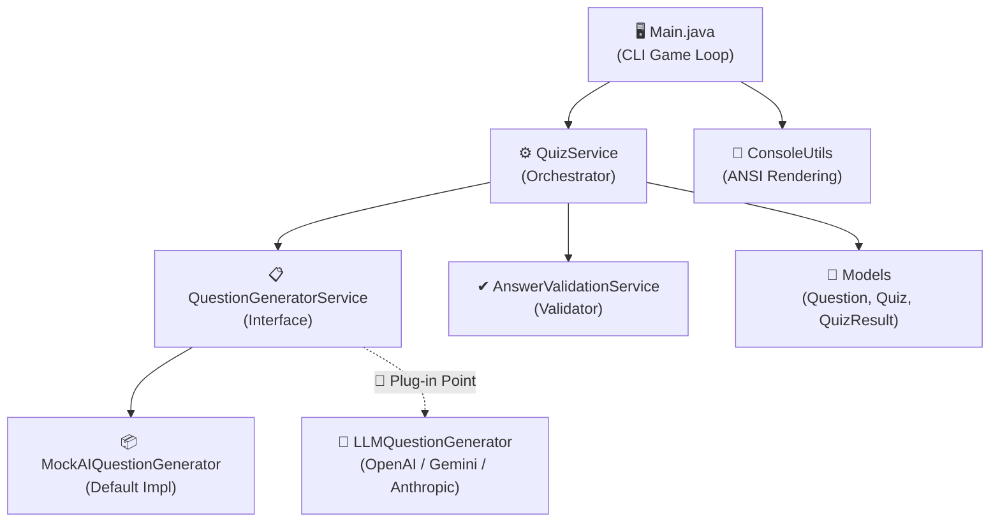

# 🧠 AI Quiz Generator


A modular, object-oriented Java 17 CLI application that dynamically generates multiple-choice quizzes across various topics, featuring real-time automated answer validation, interactive CLI rendering with ANSI styling, and an extensible architecture designed for seamless AI/LLM API integration.

---

## ✨ Key Features

- **📚 Multiple Topics**: Choose from pre-configured pools including *Core Java*, *General Science*, *World History*, and *Data Structures & Algorithms*.
- **🎲 Dynamic Question Generation**: Questions are dynamically shuffled and sampled on each run to ensure unique quiz sessions.
- **🛡️ Robust Answer Validation**: Handles edge cases including case-insensitivity, leading/trailing whitespace, and input format validation with graceful retry prompts.
- **📊 Detailed Scoring System**: Tracks user accuracy in real-time, computing percentage scores, assigning letter grades (`A+` through `F`), and rendering a comprehensive post-quiz review.
- **🔌 AI/LLM Ready**: Clean separation of concerns with a dedicated `QuestionGeneratorService` interface, making it trivial to swap the mock generator for OpenAI, Google Gemini, or Anthropic APIs.
- **🎨 Rich CLI UI**: Utilizes ANSI escape codes for vibrant colored text, banners, menus, and visual progress tracking.

---

## 🏛️ Architecture & Design

The application follows strict **Object-Oriented Design (OOD)** principles, separating **Models**, **Services**, and **UI/Execution**:



### 🗂️ Project Structure

```text
AI-Quiz-Generator/
├── pom.xml                          # Maven build configuration
├── .gitignore                       # Git ignore rules
└── src/main/java/com/aiquiz/
    ├── Main.java                    # Application entry point & game loop
    ├── model/                       # Immutable Data Models (Java Records)
    │   ├── Question.java            # Represents a single MCQ question
    │   ├── Quiz.java                # Holds topic and list of questions
    │   └── QuizResult.java          # Tracks answers, score, and grade
    ├── service/                     # Business Logic Layer
    │   ├── QuestionGeneratorService.java  # Interface for question generation
    │   ├── MockAIQuestionGenerator.java   # Mock AI implementation (shuffled pools)
    │   ├── AnswerValidationService.java   # Answer normalization & validation
    │   └── QuizService.java               # Core orchestration service
    └── util/                        # Helper Utilities
        └── ConsoleUtils.java        # Styled terminal output & ANSI coloring
```

---

## 🚀 Getting Started

### Prerequisites
- **Java Development Kit (JDK)**: Version 17 or higher.
- **Apache Maven**: Version 3.8+ (optional, manual compilation supported).

---

### Option 1: Build & Run with Maven (Recommended)

1. **Clone the repository:**
   ```bash
   git clone https://github.com/Sainath-16/AI-Quiz-Generator.git
   cd AI-Quiz-Generator
   ```

2. **Compile and execute directly:**
   ```bash
   mvn compile exec:java
   ```

3. **Or package into an executable JAR:**
   ```bash
   mvn package
   java -jar target/ai-quiz-generator-1.0.0.jar
   ```

---

### Option 2: Build & Run without Maven (Direct `javac`/`java`)

If you don't have Maven installed, you can compile using the JDK directly:

**On Windows (PowerShell):**
```powershell
# Compile all source files into target/classes
javac -encoding UTF-8 -d target\classes (Get-ChildItem -Recurse src -Filter *.java | ForEach-Object { $_.FullName })

# Run the application
java -cp target\classes com.aiquiz.Main
```

**On Linux / macOS:**
```bash
mkdir -p target/classes
javac -encoding UTF-8 -d target/classes $(find src/main/java -name "*.java")
java -cp target/classes com.aiquiz.Main
```

---

## 🤖 How to Plug in a Real LLM API

This project was specifically designed to be upgraded from the mock generator to a real Large Language Model (LLM) API (such as Google Gemini, OpenAI GPT-4, or Anthropic Claude).

### Step 1: Create an LLM Service Implementation
Create a new class in `src/main/java/com/aiquiz/service/` that implements `QuestionGeneratorService`:

```java
package com.aiquiz.service;

import com.aiquiz.model.Question;
import java.net.URI;
import java.net.http.HttpClient;
import java.net.http.HttpRequest;
import java.net.http.HttpResponse;
import java.util.List;

public class LLMQuestionGenerator implements QuestionGeneratorService {
    private final String apiKey;
    private final HttpClient httpClient = HttpClient.newHttpClient();

    public LLMQuestionGenerator(String apiKey) {
        this.apiKey = apiKey;
    }

    @Override
    public List<String> getAvailableTopics() {
        return List.of("Core Java", "General Science", "World History", "AI & Machine Learning");
    }

    @Override
    public List<Question> generateQuestions(String topic, int numberOfQuestions) {
        // 1. Construct your prompt asking for JSON output
        String prompt = String.format(
            "Generate %d multiple choice questions about %s. Format as JSON list with fields: id, text, options (array of 4 strings), correctAnswer ('A','B','C', or 'D').",
            numberOfQuestions, topic
        );

        // 2. Send HTTP POST request to your chosen LLM API endpoint
        // 3. Parse the JSON response into a List<Question> and return it
        // ...
        return parsedQuestions;
    }
}
```

### Step 2: Swap the Generator in `Main.java`
Open `src/main/java/com/aiquiz/Main.java` and locate the service wiring section (around line 30). Change one line:

```diff
- QuestionGeneratorService generator = new MockAIQuestionGenerator();
+ QuestionGeneratorService generator = new LLMQuestionGenerator(System.getenv("LLM_API_KEY"));
```

That's it! Your entire game loop, validation logic, scoring, and UI will automatically work with dynamically generated AI questions.

---

## 📝 License

This project is open-source and available under the [MIT License](LICENSE).
